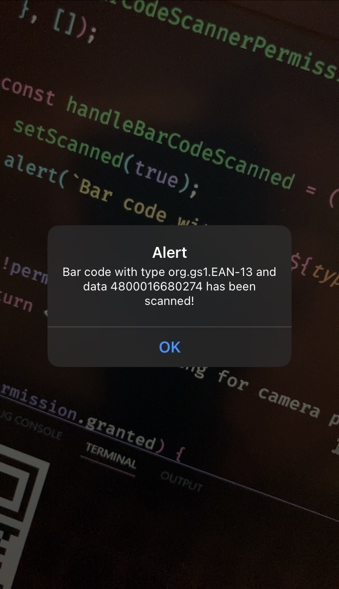

# Try Barcode Scanner

Exploring on the features of `expo-camera` and bar code scanning.

> If **expo** closes when using camera, you may want to enable all permissions manually in your settings.

## Dependencies

- `expo-camera` (https://docs.expo.dev/versions/latest/sdk/camera-next/)

```tsx
import React, { useEffect, useState } from 'react';
import { Pressable, StyleSheet, Text, View } from 'react-native';

import type { BarcodeScanningResult } from 'expo-camera/next';
import { CameraView, useCameraPermissions } from 'expo-camera/next';

export default function App() {
  const [permission, requestPermission] = useCameraPermissions();
  const [scanned, setScanned] = useState(false);

  useEffect(() => {
    requestPermission();
  }, []);

  if (!permission) ...

  if (!permission.granted) ...

  const handleBarCodeScanned = ({ type, data }: BarcodeScanningResult) => {
    if (scanned) {
      return; // prevent infinite scan
    }

    setScanned(true);
    alert(`Bar code type ${type} and data ${data} has been scanned!`)
  };

   return (
      <CameraView
        style={StyleSheet.absoluteFillObject}
        onBarcodeScanned={handleBarCodeScanned}>
        {scanned && (
          <View style={styles.container}>
            <Pressable style={styles.button}>
              <Text style={styles.text}>
                Double Tap anywhere to Scan Again
              </Text>
            </Pressable>
          </View>
        )}
      </CameraView>
  );
}

const styles = StyleSheet.create({ ... });
```

## Example


